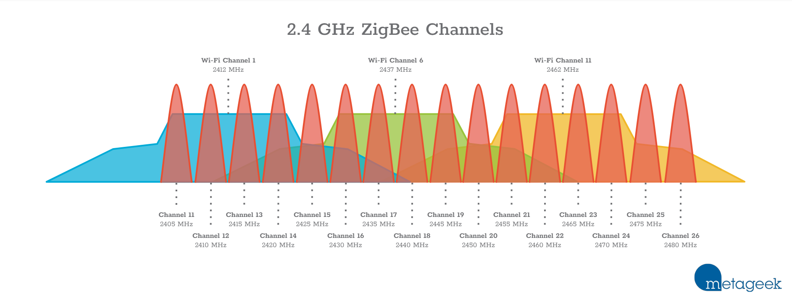

# Lighting

Everything to automate lighting as much as possible

### Hardware
- [Conbee II](https://www.phoscon.de/en/conbee2) Zigbee stick
  - Using a 3m USB cable extension, less interference
  - Using default Zigbee channel 15
  - Using ZHA
  - (migrating devices to SkyConnect stick, probably transforming this one to Thread)
- [Home Assistant SkyConnect](https://www.home-assistant.io/skyconnect/) Zigbee stick
  - Using a 0.5m USB cable extension (which was in the box)
  - Using Zigbee channel 25, so that Wi-Fi channel 1 and 6 are usable
  - Using Zigbee2MQTT, with the following settings (as recommended [here](https://skyconnect.home-assistant.io/faq/#is-zigbee2mqtt-supported-by-skyconnect)):
    ```yaml
    serial:
      adapter: ezsp
      port: /dev/serial/by-id/<the device id>
      baudrate: 115200
      rtscts: true
    ```
  - Using Mosquitto (as Home Assistant add-on)
- Ikea FLOALT panel WS 30x30
- Ikea FLOALT panel WS 90x30
- Ikea TRADFRI bulb E27 CWS opal 600lm
  - Color version
- Ikea TRADFRI bulb E27 W opal 1000lm
  - Used in hallways/closets
- Ikea TRADFRI bulb GU10 W 400lm
  - Spots used in the living room and a bedroom
- Ikea TRADFRI remotes
- [Ikea TRADFRI Smart outlet](https://www.ikea.com/nl/en/p/tradfri-wireless-control-outlet-smart-90356166/)
  - Simple but bulky outlets
  - Support a full 16A @ 230V
- [Hue motion sensor](https://www.philips-hue.com/nl-be/p/hue-bewegingssensor/8719514342125)
  - Have a short reset time of ~5 seconds before they can sense motion again
  - Detection is quicker than the Ikea ones
  - Have a light sensor
  - Have a temperature sensor
- [Hue outdoor motion sensor](https://www.philips-hue.com/en-us/p/hue-outdoor-sensor/046677541736)
- [Hue indoor ledstrip](https://zigbee.blakadder.com/Philips_LST002.html)
- [Gledopto GL-C-008](https://www.gledopto.com/h-col-324.html), bought [here](https://www.ledstripkoning.nl/speciale-leds/zigbee-philips-hue-controller/losse-zigbee-controllers/losse-zigbee-controller-voor-rgbww-led-strips-te-bedienen-met-philips-hue/)
  - Controls a LED strip along a bed


### Software
- [ZHA integration](https://www.home-assistant.io/integrations/zha)
  - Runs the whole Zigbee network

### Features
- Light groups for lights that are in the same armature
- Light groups for lights in the same area or room
- Automatic living room lights based on presence
- Smart turn-on brightness based on the time of the day
- Summary UI for on the home screen
- Detailed UI for all lights

## Zigbee and Wi-Fi channel notes
Just some documentation on Zigbee channel usage, as gathered from various places
- Wi-Fi on the 2.4 Ghz band has 14 channels, with number 1 till 14 ([wikipedia](https://en.wikipedia.org/wiki/List_of_WLAN_channels#2.4_GHz_(IEEE_802.11b-1999|802.11b/IEEE_802.11g-2003|g/IEEE_802.11n-2009|n/Wi-Fi_6|ax)))
  - 14 is not allowed in most places
  - 12 and 13 are avoided in North America (only low power allowed)
  - Channels overlap quite a lot, effectively only channel 1, 6 and 11 can be used mostly independently
  - 
    - From [Metageek](https://www.metageek.com/training/resources/zigbee-wifi-coexistence/)
- There are 16 Zigbee channels in the 2.4 GHZ range, with number 11 till 26:
  - 
    - From [Metageek](https://www.metageek.com/training/resources/zigbee-wifi-coexistence/) 
- Zigbee Light Link primary channels: 11, 15, 20, 25
  - These seem preferred by controller software and devices, they often try scanning these channels first before others
  - Some devices only work on these channels and not others
- Channel 15 is the default in ZHA and a bunch of other tools
  - [ZHA docs](https://www.home-assistant.io/integrations/zha/#defining-zigbee-channel-to-use) mention it is best to keep that channel
  - It also mentions generally only 15, 20, 25 should be used for best device compatibility

Wi-Fi and Zigbee channels in a graph:


